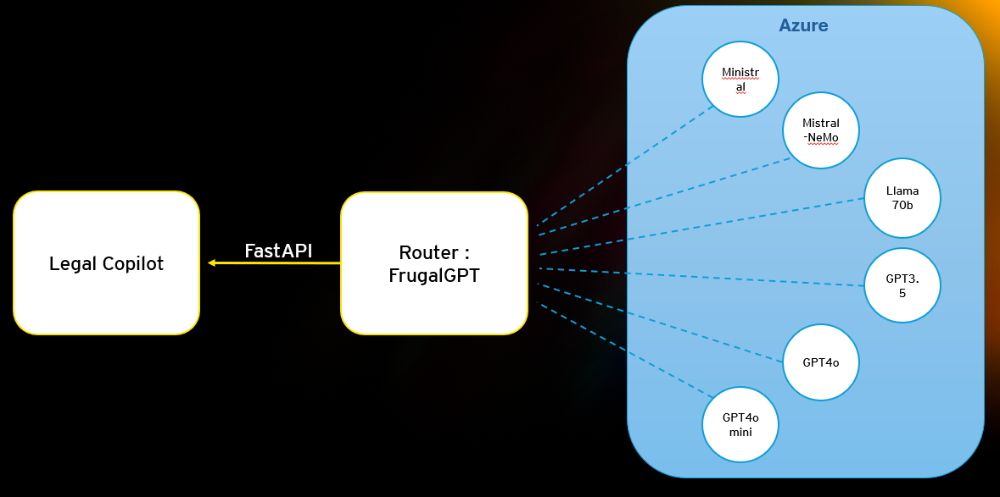

# Interaction between Azure Production RAG and FrugalGPT

This document describes the interactions between the `azure-production-rag` and `FrugalGPT` projects, as well as the changes made to enable their integration. It aims to provide a clear and detailed overview.

---

## Context

- **Azure Production RAG**: This project implements a Retrieval-Augmented Generation (RAG) system in production on Azure. It integrates advanced language models and document retrieval pipelines.

- **FrugalGPT**: This project optimizes the cost of using language models by combining computational efficiency strategies and lightweight models. It relies on techniques such as prompt adaptation, LLM model approximation, and model cascades.

The main goal of the integration is to leverage FrugalGPT's optimizations to reduce inference costs in Azure Production's RAG pipeline while maintaining high response quality.

---

## Project Architecture



---

## Changes Made

### In `azure-production-rag`

1. **Integration with FrugalGPT**:
   - Modified the `chatreadretrieveread.py` file (in the `approaches` folder of the backend) to call FrugalGPT. This file transmits the necessary information to generate a response and obtain a cost estimate for the query.
   - Created the `server_client.py` file, called by `chatreadretrieveread.py`, to handle communication with FrugalGPT via port 8000 on localhost. This file performs:
     - A call to the model cascade.
     - A cost comparison between different models.
     - An HTTP 200 response in case of successful operation.

### In `FrugalGPT`

1. **Support for RAG Pipelines**:
   - Added specific features for RAG pipelines, including:
     - Processing contextual queries to ensure response consistency.
     - Optimized management of retrieved documents for lightweight models.

2. **Integration API**:
   - Developed a REST API for seamless interaction with Azure Production RAG. This API includes:
     - Endpoints for cost-optimized inference.
     - Real-time cost metrics.
     - Robust error handling to ensure reliability.

3. **Computational Efficiency Strategies**:
   - Implemented fallback mechanisms: lightweight models are prioritized, and heavy models are only called when necessary.
   - Dynamic resource management to adjust models based on cost and latency constraints.
   - Introduced a caching solution in the `llmcache.py` file to reuse responses to similar questions, avoiding unnecessary API calls.
   - Used the `sentence-transformers` library with the `all-mpnet-base-v2` model available on Hugging Face: [link](https://huggingface.co/sentence-transformers/all-mpnet-base-v2). This model can be downloaded locally or called directly.

---

## Interaction Points

1. **Inference Pipeline**:
   - Azure Production RAG delegates certain inference steps (response generation, scoring, etc.) to FrugalGPT via the REST API.
   - FrugalGPT returns optimized results, which are then integrated into the global pipeline.

2. **Cost Management**:
   - FrugalGPT provides detailed metrics, such as:
     - Cost per query.
     - Savings achieved compared to exclusive use of heavy models.
   - These metrics allow Azure Production RAG to dynamically adjust its execution strategies.

3. **Data Sharing**:
   - Both projects share data, including:
     - Retrieved documents to ensure response consistency.
     - Usage logs to refine models and optimization strategies.

---

## Developer Instructions

### Configuration in `azure-production-rag`

1. Configure your Azure environment with your subscription and required services.
2. Start the backend and frontend with the command:
   ```bash
   ./start.ps1
   ```
3. Ensure that the `server_client.py` file (in the `core` folder of the backend) contains the necessary parameters to establish the connection with FrugalGPT.

### Configuration in `FrugalGPT`

1. Download the required database with the command:
   ```bash
   wget -P db/ https://github.com/lchen001/DataHolder/releases/download/v0.0.1/HEADLINES.sqlite
   ```
2. Install the required dependencies:
   ```bash
   pip install -r requirements.txt
   ```
3. Create a `.env` file containing the necessary endpoints and API keys.

### Running `FrugalGPT`

1. Test the LLM models and configure the cascade strategy with:
   ```bash
   python approachfrugalgpt.py
   ```
2. Start the server to enable the REST API:
   ```bash
   uvicorn main:app --reload
   ```
3. You can run both commands sequentially with:
   ```bash
   ./run_scripts.ps1
   ```

### Running `FrugalGPT` and `azure-production-rag` Together

1. Launch the respective commands:
   - For FrugalGPT: `uvicorn main:app --reload`
   - For Azure Production RAG: `./start.ps1`
2. Once both projects are running, the interaction between the two repositories allows answering questions posed via the Legal Copilot frontend interface.

---

## Conclusion

This integration combines the power of Azure Production's RAG pipelines with FrugalGPT's advanced optimizations, offering a performant, cost-effective, and adaptable system. For any questions or issues, refer to the `CONTRIBUTING.md` and `CHANGELOG.md` files in both projects. Feel free to submit suggestions or bug reports via the respective GitHub repositories.